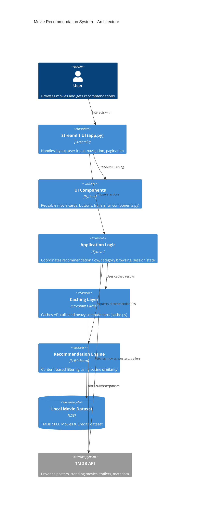

# 🎬 Movie Recommendation System

A **Netflix / IMDb–style Movie Recommendation Web App** built with **Python & Streamlit**, powered by the **TMDB API** and a **content-based recommendation engine**.


🔗 **Live Demo:**  
https://movie-recommendation-system--gopiprajapati20.replit.app

[](https://movie-recommendation-system--gopiprajapati20.replit.app)


---
## 👤 What Users Can Do

- Discover trending movies
- Select a movie and get similar recommendations
- Browse movies by category and genre
- Navigate smoothly using page-based pagination

---

## 🚀 Features

- 🔥 **Trending Movies**
  - Weekly trending movies from TMDB
- 🎯 **Content-Based Recommendations**
  - Based on genres, overview, cast, and crew
- 🎬 **Movie Selection via Dropdown**
  - Clean UI (no search clutter)
- 🎞 **Browse by Category & Genre**
  - Hollywood, Bollywood, K-Drama  
  - Action, Comedy, Romance  
  - Horror, Thriller, Sci-Fi  
  - Drama, Animation
- 📄 **Production-Correct Pagination**
  - Fixed movies per page
  - Next / Previous navigation
  - No duplicates
- 🖼 **High-Quality Posters**
  - Fetched directly from TMDB
- ⚡ **Fast & Interactive UI**
  - Cached API calls & data processing
---

## 🖼️ Screenshots

<details>
<summary>Home Page</summary>

Trending movies and main layout:


</details>

<details>
<summary>Find a Movie & Recommendations</summary>

Select a movie from the dropdown and get recommendations:


</details>

<details>
<summary>Browse by Category</summary>

Category browsing with pagination:


</details>

---

## 🧠 Recommendation Logic

This system uses **content-based filtering**:

- Movie overview
- Genres
- Cast
- Crew

All features are combined into a single representation, and  
**cosine similarity** is used to find movies most similar to the selected one.

---

## 🛠 Tech Stack

- **Python 3**
- **Streamlit**
- **Pandas**
- **Scikit-learn**
- **TMDB API**
- **Requests**

---

## 📂 Project Structure

```bash
Movie-Recommendation-System/
│
├── app.py
├── requirements.txt
├── README.md
├── .gitignore
│
├── data/
│   ├── tmdb_5000_movies.csv
│   └── tmdb_5000_credits.csv
│
├── src/
│   ├── preprocess.py
│   ├── recommender.py
│   ├── cache.py
│   ├── tmdb_api.py
│   └── ui_components.py
│
└── screenshots/
    ├── Trending_now.png
    ├── recommendation.png
    ├── browse_by_category1.png
    └── browse_by_category2.png
```
---

## 🏗️ System Architecture



---

## ⚙️ Installation & Setup

### 1️⃣ Clone the repository
```bash
git clone https://github.com/your-username/movie-recommendation-system.git
cd movie-recommendation-system
```

### 2️⃣ Create virtual environment (optional but recommended)

```bash
python -m venv venv
source venv/bin/activate   # macOS/Linux
venv\Scripts\activate      # Windows
```

### 3️⃣ Install dependencies
```bash
pip install -r requirements.txt
```

### 4️⃣ Set TMDB API Key

Create a TMDB API key from
👉 https://www.themoviedb.org/

Then set it as an environment variable:

macOS/Linux
```bash
export TMDB_API_KEY="your_api_key_here"
```

Windows
```bash
set TMDB_API_KEY=your_api_key_here
```

### ▶️ Run the App
```bash
streamlit run app.py
```
The app will open automatically in your browser 🚀

---

## 📜 License

This project is licensed under the **MIT License**.  
You are free to use, modify, and distribute this project with attribution.

See the [LICENSE](LICENSE) file for details.

